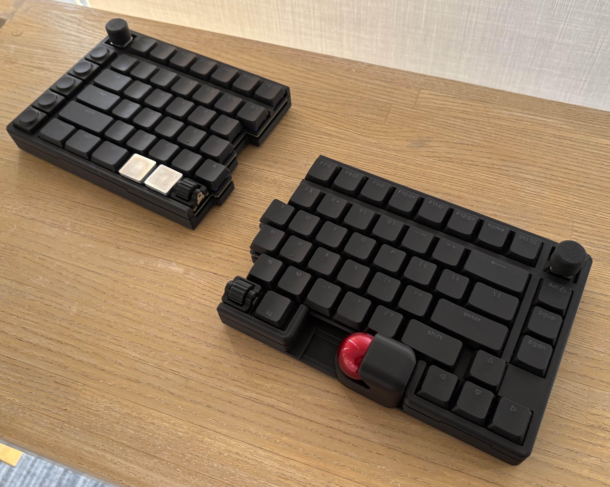

# ⅢQBall (US Layout)

自作キーボード「ⅢQBall」の英語配列用ファームウェアリポジトリです。

## コンセプト：誰もが使いやすい、究極の効率化

IIIQBallは、長時間の作業でも疲れにくく、直感的な操作を可能にすることを目的として設計されました。
その名称には、3つの「ⅢQ」にまつわる想いを込めています。

### 1. Triple Meaning (名称の由来)
* **75% Layout (Three-Quarters)**: 
    フルサイズの3/4（75%）に必要な機能を凝縮。さらに、一般的なキーボードと同じ**「ロースタッカード（横方向のズレ）」**配列を採用することで、自作キーボード特有の学習コストを排除。誰でも手にした瞬間から違和感なく扱えるレイアウトです。
* **Thank you**: 
    これまでのキーボード文化を築き上げてきた先人たち、そしてコミュニティへの深い感謝（Thank you）を込めています。
* **The Triple "Q"**:
    * **Quest**: 理想の操作性の探求。
    * **Quick**: トラックボールと分割レイアウトによる、淀みのない素早い操作。
    * **Quality**: 道具としての質、そしてクリエイティブな時間の質の向上。

### 2. 身体的・機能的な強み
* **肩こりからの解放**: 左右分割式を採用し、胸を開いた自然な姿勢をキープ。長時間の作業でも肩の負担を劇的に軽減します。
* **ホームポジションを維持**: 右側にトラックボールマウスを配置。キーボードとマウスの往復運動をゼロにし、集中力を途切れさせません。
* **直感的な微調整**: 最大4つのエンコーダーを搭載。音量、ズーム、タイムライン操作など、クリエイティブな作業における細かな調整を直感的に行えます。

---

## 主な機能
- **左右分割エルゴノミクス設計**: 肩の負担を軽減し、体格に合わせた最適な位置に配置可能。
- **統合型トラックボール**: 腕の移動を最小限に抑え、デスクスペースも有効活用。
- **馴染みやすい75%ロースタッカード**: ノートPCや一般的なキーボードと同じ感覚で打鍵可能。
- **4つのエンコーダー対応**: 垂直・水平（CKW12）の操作が可能。スイッチ付きエンコーダーも選択でき、あらゆるパラメーター操作に対応。
- **マルチソケット設計**: Kailh Choc（ロープロファイル）とCherry MXの両プロファイルに対応。
- **専用マクロキー**: 複雑な操作をワンタップで実行可能。

---

## ファームウェアインストール / キーマップ変更

### 初回インストール手順
1.  GitHubアカウントにログインし、本リポジトリを **Fork** してください。
2.  Forkしたリポジトリの **Actions** タブから「I understand my workflows, go ahead and enable them」をクリックして有効化します。
3.  ビルドが成功すると緑のチェックマークが表示されます。`firmware.zip` をダウンロード・解凍して、左右それぞれのUF2ファイルを用意します。
4.  マイコン（XIAO）のコネクタ左上にあるボタンを **ダブルクリック** して、PCにドライブとして認識させます。
5.  対応するUF2ファイルをドラッグ＆ドロップすれば完了です。

### キーマップの変更方法

1.  **[ZMK Studio](https://zmk.studio) (簡易変更)**
    * アプリ版を使用すれば、ワイヤレス状態でもリアルタイムにキー設定を変更できます。主にキースイッチの割り当て変更に最適です。
    

2.  **[KeymapEditor](https://nickcoutsos.github.io/keymap-editor) (詳細設定)**
    * エンコーダーの挙動、マクロ設定、レイヤーの追加、変更履歴の管理などが可能です。
    * 編集後「Save」を押すとGitHubリポジトリが自動更新され、4〜5分で新しいファームウェアがビルドされます。
    

## レイヤー設定
* **レイヤー1 (Mouse/Scroll)**: レイヤー1に切り替えることで、トラックボールをページスクロール操作として使用可能です。